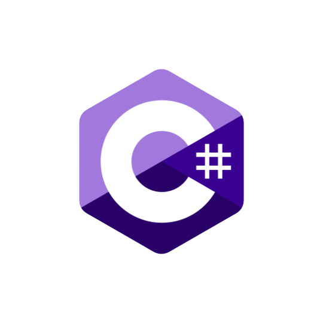
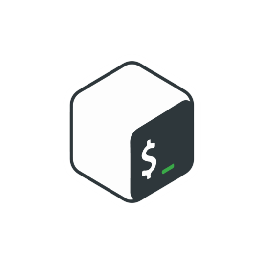
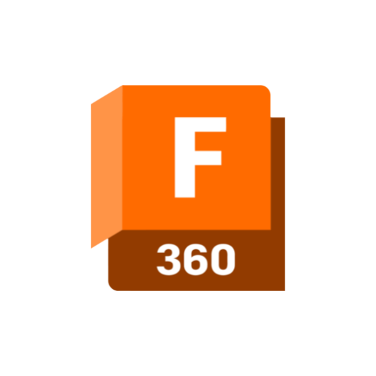

<h1 align="center">
  
</h1>

<h5 align="center">
  <code><a href="https://www.linkedin.com/in/salma-baig/" title="LinkedIn Profile"> LinkedIn</a></code>
  <code><a href="https://salmabaig.com" title="Portfolio Site"> Portfolio Site</a></code>
    <code><a href="https://www.youtube.com/@hydroxy_the_tutor" title="Portfolio Site"> YouTube</a></code>
</h5>
 

   
   
  🔬 I'm a Software and Biomedical Engineering undergraduate student
   
  📫 You can reach me at <a href="mailto: baigs19@mcmaster.caa">baigs19@mcmaster.ca</a>

<h2 align="center">Languages, Frameworks, Tools, and Skills</h2>
 

  
  
  
  
  

<h2 align="center">Stats</h2>
 

  

<h2 align="center">Repositories</h2>
 

  <a align="left" href="https://github.com/hydrowoxy/a1-maze-runner-hydrowoxy" title="Maze Runner">

      

<h4 align="center">
  <a href="https://github.com/hydrowoxy?tab=repositories" title="Show Repositories">🔎 Show More 🔍</a>
</h4>

<!--
**hydrowoxy/hydrowoxy** is a ✨ _special_ ✨ repository because its `README.md` (this file) appears on your GitHub profile.

Here are some ideas to get you started:

- 🔭 I’m currently working on ...
- 🌱 I’m currently learning ...
- 👯 I’m looking to collaborate on ...
- 🤔 I’m looking for help with ...
- 💬 Ask me about ...
- 📫 How to reach me: ...
- 😄 Pronouns: ...
- ⚡ Fun fact: ...
-->
